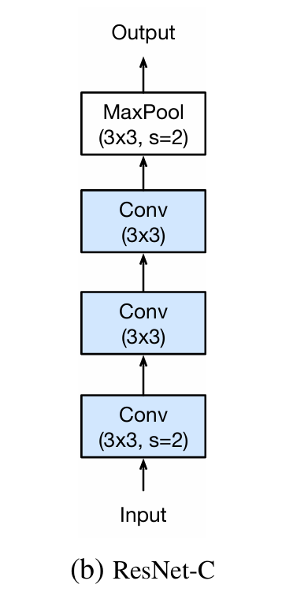
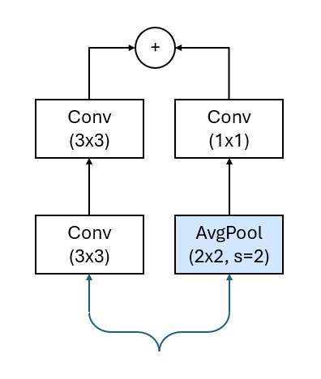

# ResNet18-1DD

A fully serializable 1D implementation of ResNet18, incorporating improvements from the paper ["Bag of Tricks for Image Classification with Convolutional Neural Networks"](https://arxiv.org/abs/1812.01187) along with additional personal optimizations and modifications.

This repository also includes implementations of the Hardswish and Mish activation functions:

- [Searching for MobileNetV3](https://arxiv.org/abs/1905.02244)
- [Mish: A Self Regularized Non-Monotonic Neural Activation Function](https://arxiv.org/abs/1908.08681)

The codebase is fully integratable inside the TensorFlow and Keras code pipelines.

## Key Enhancements
- **Modified Stem:** Utilizes two convolutional layers instead of a single one.
- **ResNet-D Inspired Shortcut:** Introduces an average pooling layer before the 1x1 convolution in the shortcut connection.
- **Reduced Downsampling:** Downsampling is now performed only twice (in the stem block) instead of the original five times.

<br/>
<br/>
<div align="center" style="display: flex; justify-content: center; align-items: center;">
    
    
</div>
<br/>

*Note: The images above represent the architectural modifications. They depict 2D convolutional layers, whereas this project is focused on 1D convolutions. The ResNet-C image is sourced from the referenced paper, while the shortcut image is created by the author.*

## Installation & Usage
This code is compatible with **Python 3.12.8** and **TensorFlow 2.18.0**.

```python
from ResNet181DD import ResNet181DD

model = ResNet181DD()
model.build((None, 128, 32))
model.summary()
```

### Model Summary Example
```bash
Model: "res_net181dd"
┏━━━━━━━━━━━━━━━━━━━━━━━━━━━━━━━━━━━━━━┳━━━━━━━━━━━━━━━━━━━━━━━━━━━━━┳━━━━━━━━━━━━━━━━━┓
┃ Layer (type)                         ┃ Output Shape                ┃         Param # ┃
┡━━━━━━━━━━━━━━━━━━━━━━━━━━━━━━━━━━━━━━╇━━━━━━━━━━━━━━━━━━━━━━━━━━━━━╇━━━━━━━━━━━━━━━━━┩
│ conv1d_layer (Conv1DLayer)           │ (None, 64, 32)              │           3,072 │
├──────────────────────────────────────┼─────────────────────────────┼─────────────────┤
│ conv1d_layer_1 (Conv1DLayer)         │ (None, 64, 32)              │           3,072 │
├──────────────────────────────────────┼─────────────────────────────┼─────────────────┤
│ conv1d_layer_2 (Conv1DLayer)         │ (None, 64, 64)              │           6,144 │
├──────────────────────────────────────┼─────────────────────────────┼─────────────────┤
│ max_pooling1d (MaxPooling1D)         │ (None, 32, 64)              │               0 │
├──────────────────────────────────────┼─────────────────────────────┼─────────────────┤
│ residual1dd (Residual1DD)            │ (None, 32, 64)              │          24,576 │
├──────────────────────────────────────┼─────────────────────────────┼─────────────────┤
│ residual1dd_1 (Residual1DD)          │ (None, 32, 128)             │          81,920 │
├──────────────────────────────────────┼─────────────────────────────┼─────────────────┤
│ residual1dd_2 (Residual1DD)          │ (None, 32, 128)             │          98,304 │
├──────────────────────────────────────┼─────────────────────────────┼─────────────────┤
│ residual1dd_3 (Residual1DD)          │ (None, 32, 256)             │         327,680 │
├──────────────────────────────────────┼─────────────────────────────┼─────────────────┤
│ residual1dd_4 (Residual1DD)          │ (None, 32, 256)             │         393,216 │
├──────────────────────────────────────┼─────────────────────────────┼─────────────────┤
│ residual1dd_5 (Residual1DD)          │ (None, 32, 512)             │       1,310,720 │
├──────────────────────────────────────┼─────────────────────────────┼─────────────────┤
│ residual1dd_6 (Residual1DD)          │ (None, 32, 512)             │       1,572,864 │
├──────────────────────────────────────┼─────────────────────────────┼─────────────────┤
│ global_average_pooling1d             │ (None, 512)                 │               0 │
│ (GlobalAveragePooling1D)             │                             │                 │
├──────────────────────────────────────┼─────────────────────────────┼─────────────────┤
│ dense (Dense)                        │ (None, 256)                 │         131,328 │
└──────────────────────────────────────┴─────────────────────────────┴─────────────────┘
 Total params: 3,952,896 (15.08 MB)
 Trainable params: 3,952,896 (15.08 MB)
 Non-trainable params: 0 (0.00 B)
```

## License
This work is under an [MIT](https://choosealicense.com/licenses/mit/) License.